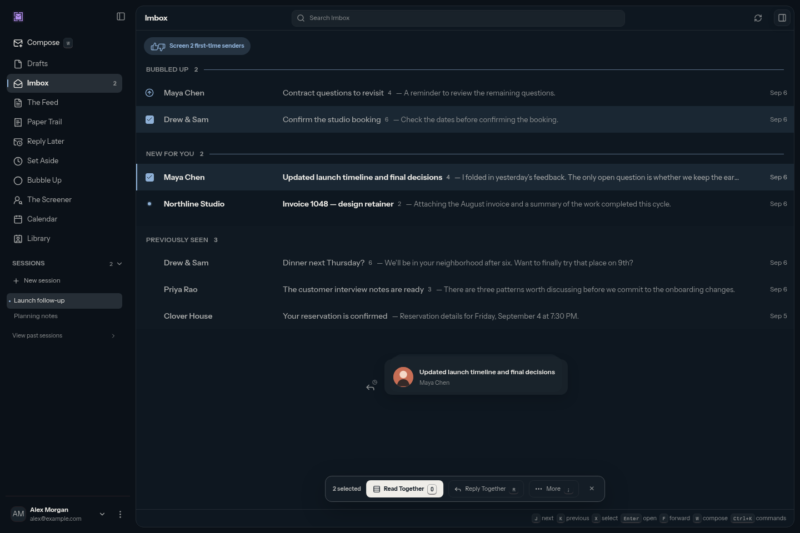
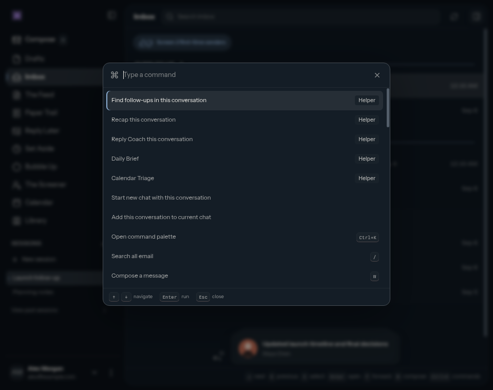
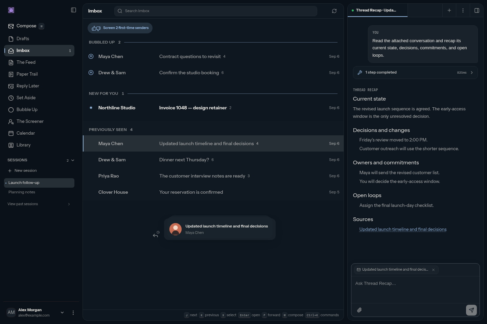
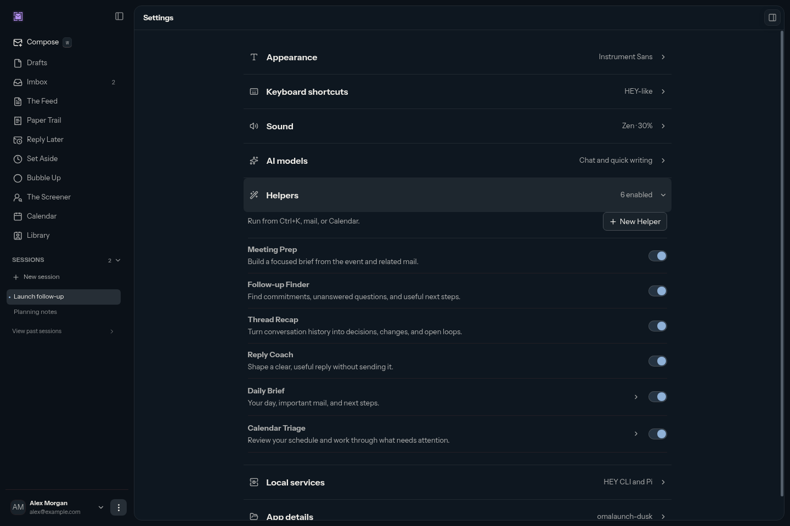
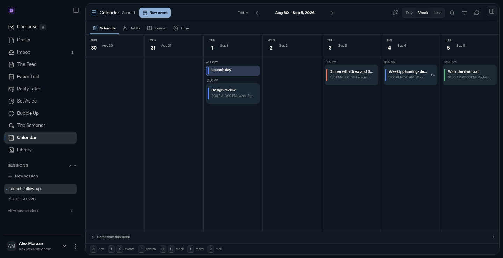
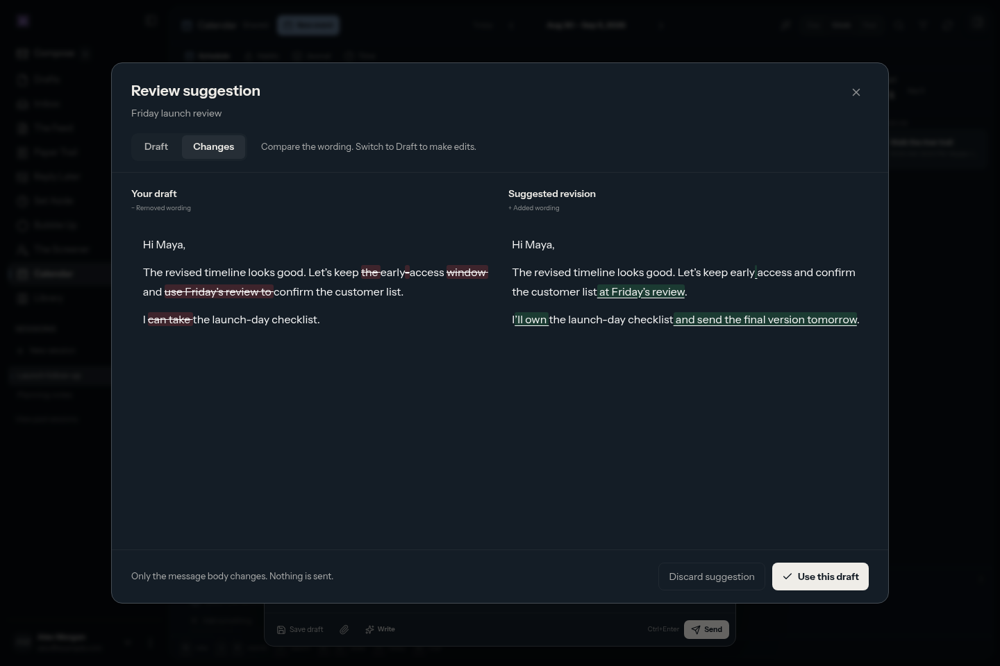
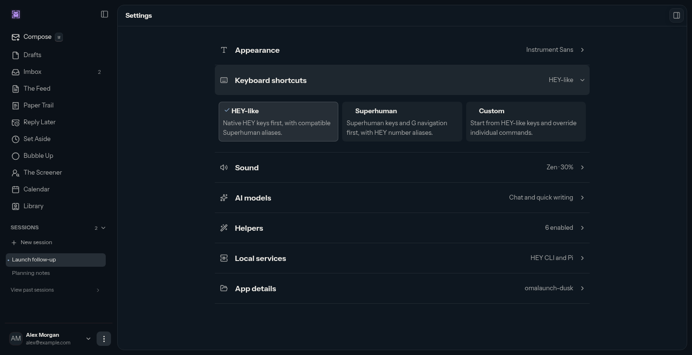

<h1> HEY Agent</h1>

A keyboard-first desktop app for HEY mail and Calendar, with your Pi agent alongside your inbox.

Work through your inbox, plan your day, and get help with the reply you've been putting off, all in one place.

- Navigate, search, and organize mail with customizable keyboard shortcuts.
- Manage your HEY calendar alongside your conversations.
- Ask Helpers (Agents) for a Daily Brief, meeting prep, reply coaching, and calendar triage.
- Create your own Helpers (Agents) with instructions for the work you do often.
- Review and edit AI-written drafts, including a comparison of what changed.
- Continue work in another agent with a prepared handoff prompt.

The tested platform is **x86-64 Omarchy** (Intel or AMD). This is an independent project, not an official HEY, Basecamp, or Omarchy app.

## A look inside

### Work through mail from your keyboard

Move with `J` / `K`, open with `Enter`, and select with `X` or `Shift+J` / `Shift+K`. `Ctrl+K` opens commands and Helpers. Shortcuts are customizable.



### Find a command without hunting through menus

Press `Ctrl+K`, type what you need, and hit `Enter`. Helpers are labeled, and commands show their keyboard shortcuts.



### Keep AI beside the conversation

Ask a Helper to recap a thread, find follow-ups, or help with a reply. Attached context and source links keep the conversation close. `Ctrl+Shift+L` focuses AI chat.



### Choose your Helpers—or create your own

Enable the Helpers you use in Settings. Choose **New Helper** to add your own instructions.



### See your week in one place

Plan events across your HEY calendars and keep tasks in Sometime This Week. Habits, Journal, and Time are a tab away.



### Review the wording before using it

Compare your draft with the suggestion and edit the suggested wording directly in **Changes**, or use the **Draft** view. Choose **Use this draft** when you're ready.



## Keyboard shortcuts

HEY-like defaults on Linux. Single-letter shortcuts work outside text fields. The current view determines what a key does; `G` then `,` means two consecutive presses.

### Navigation

| Shortcut | Action |
| --- | --- |
| `Ctrl+K` | Open command palette |
| `/` | Search all email |
| `W` or `C` | Compose a message |
| `Ctrl+B` | Toggle navigation sidebar |
| `1` | Imbox |
| `2` | The Feed |
| `3` | Paper Trail |
| `4` | Reply Later |
| `5` | Set Aside |
| `6` | Bubble Up |
| `7` | Sessions |
| `8` | The Screener |
| `9` | Previously Seen |
| `0` | Calendar; return to mail when in Calendar |
| `G` then `,` | Settings |

### Mail list and conversations

| Shortcut | Action |
| --- | --- |
| `J` or `↓` | Next conversation |
| `K` or `↑` | Previous conversation |
| `Enter` | Open conversation |
| `Esc` | Close conversation or clear selection |
| `X` | Toggle selection |
| `Shift+J` or `Shift+↓` | Extend selection down |
| `Shift+K` or `Shift+↑` | Extend selection up |
| `R` | Reply |
| `F` | Forward |
| `E` | Mark seen |
| `U` | Toggle read / unread |
| `L` or `H` | Add or remove Reply Later |
| `A` | Add or remove Set Aside |
| `Z` | Bubble up tomorrow, or cancel an active Bubble Up |
| `T` or `#` | Move to Trash |
| `Ctrl+Z` | Cancel the latest pending trash action (five-second window; text fields keep normal Undo) |
| `↑` / `↓` | Scroll an open conversation |
| `Space` / `Shift+Space`, `PageDown` / `PageUp` | Page through an open conversation |
| `Home` / `End` | Top / bottom of an open conversation |

Hold navigation or selection keys to repeat.

### Selected conversations

| Shortcut | Action |
| --- | --- |
| `;` | Focus bulk actions |
| `O` | Read Together |
| `R` | Reply Together |
| `B` | Add to a label |
| `N` | Add to a Collection |
| `I` | Move to Imbox |
| `D` | Move to The Feed |
| `P` | Move to Paper Trail |
| `-` | Ignore conversations |
| `Q` | Undo the last bulk action while its undo notice is available |

### Email composer

| Shortcut | Action |
| --- | --- |
| `Ctrl+K` | Open AI writing help |
| `Ctrl+Enter` | Send message |
| `Ctrl+S` | Save draft, where available |
| `Ctrl+Shift+C` | Show and focus Cc |
| `Ctrl+Shift+B` | Show and focus Bcc |
| `Ctrl+Shift+A` | Attach files |
| `Esc` | Close writing help or the composer |
| `↑` / `↓` in recipients | Move through contact suggestions |
| `Enter` / `Tab` in recipients | Accept the highlighted suggestion |
| `Enter` with a typed address | Add the recipient |
| `Backspace` in an empty recipient field | Remove the last recipient |
| `Esc` in contact suggestions | Close suggestions |

### AI chat and sessions

| Shortcut | Action |
| --- | --- |
| `Ctrl+Shift+L` | Focus AI chat composer |
| `Ctrl+Shift+B` | Toggle AI sidebar, outside the email composer |
| `Ctrl+Enter` | Send the AI chat message |
| `Ctrl+T` | New session |
| `Ctrl+W` | Close session |
| `Ctrl+Tab` / `Ctrl+Shift+Tab` | Next / previous session |
| `Ctrl+1` through `Ctrl+9` | Switch to that session tab, outside text fields |
| `←` / `→` on session tabs | Previous / next session |

Run Helpers from `Ctrl+K`; open external agent handoffs from the session menu. Neither has a dedicated default shortcut.

### AI writing and draft review

| Shortcut | Action |
| --- | --- |
| `Ctrl+Enter` in writing help | Generate a suggestion |
| `Ctrl+Enter` in draft review | Apply the reviewed draft |
| `Esc` in draft review | Discard the suggestion |
| `←` / `→` on the review tabs | Switch between Draft and Changes |
| `Home` / `End` on the review tabs | First / last tab |
| `Esc` in an agent handoff | Close the handoff |

### Calendar

| Shortcut | Action |
| --- | --- |
| `N` | New event |
| `T` | Today |
| `D` | Day view |
| `W` or `U` | Week view |
| `Y` | Year view |
| `H` or `←` | Previous date range |
| `L` or `→` | Next date range |
| `J` or `↓` | Next event |
| `K` or `↑` | Previous event |
| `Enter` | Open highlighted event |
| `/` | Search Calendar |
| `Ctrl+F` | Filter the current view |
| `B` | Habits |
| `G` | Journal |
| `R` | Time |
| `E` in event details | Edit event |
| `Delete` or `Backspace` in event details | Review event deletion |
| `Ctrl+Enter` in the event editor | Create, review invitations, or save changes |
| `Esc` | Close the current editor, detail, search, or filter |

### Command palette and forms

| Shortcut | Action |
| --- | --- |
| `↓` / `↑`, `Tab` / `Shift+Tab` in the palette | Next / previous command |
| `Home` / `End` in the palette | First / last command |
| `PageDown` / `PageUp` in the palette | Jump eight commands |
| `Enter` in the palette | Run the selected command |
| `Esc` in the palette | Close commands |
| `Enter` in mail search | Search |
| `↓` / `↑` in Calendar search | Next / previous result |
| `Tab` / `Shift+Tab` in forms | Next / previous control |

### Interface size

| Shortcut | Action |
| --- | --- |
| `Ctrl++` or `Ctrl+=` | Zoom in |
| `Ctrl+-` | Zoom out |
| `Ctrl+0` | Reset zoom |

### Choose your shortcuts

Settings → Keyboard shortcuts offers **HEY-like**, **Superhuman**, and **Custom** profiles. Choose Custom to edit individual bindings.



## Install

### Copy and paste for your agent

Have a local coding agent? Give it this prompt to handle setup and installation:

```text
Help me install HEY Agent from https://github.com/rblalock/hey-mail-client.
Follow README.md and docs/linux-install.md. Check my Linux architecture,
HEY CLI, Pi, and HEY skill; help me set up anything missing. Let me handle
logins and passwords, and ask before system changes or closing an app.

Download a compatible AppImage from GitHub Releases, tell me its version,
and help me add it to my application launcher.
```

### Download the AppImage

Get the Linux x86-64 AppImage from [GitHub Releases](https://github.com/rblalock/hey-mail-client/releases). Each release includes a standalone app and an installer bundle that adds a desktop launcher.

Download `HEY-Agent-VERSION-x86_64.AppImage`. In your download directory, replace `VERSION` with the version you downloaded:

```sh
chmod +x HEY-Agent-VERSION-x86_64.AppImage
./HEY-Agent-VERSION-x86_64.AppImage
```

For a desktop launcher, download `HEY-Agent-VERSION-linux-x86_64.tar.gz` instead and follow [the installer steps](docs/linux-install.md#install-or-update). GitHub's “Source code” archives are not installers. Early `0.x` releases are marked prerelease.

### Requirements

- Linux x86-64 (tested on Omarchy).
- A HEY account and [HEY CLI](https://github.com/basecamp/hey-cli) 1.4.3 or newer, installed and signed in (`hey upgrade` to update).
- [Pi](https://github.com/earendil-works/pi/tree/main/packages/coding-agent), connected to a model.
- The HEY skill installed for Pi.
- FUSE 2 for running AppImages.

## Manual build from source

To build your own AppImage, install Git, Node.js 22.12 or newer, and npm. Use Linux with the same CPU architecture as the destination machine.

```sh
git clone https://github.com/rblalock/hey-mail-client.git
cd hey-mail-client
npm ci
npm run package:linux
```

For a published version, check out its exact `vVERSION` tag before `npm ci`. Otherwise, `main` is a development snapshot. Dependency installation runs scripts, so use source and dependencies you trust.

Output goes into `release/`. The build prints the exact install command, for example:

```sh
bash release/install.sh release/HEY-Agent-VERSION-x86_64.AppImage
```

Replace `VERSION` with the version in `package.json`. No publishing credentials are needed, and nothing is uploaded.

## Develop locally

Clone the repository using the commands above, then run these from the checkout. You don't need to package or install an AppImage to develop:

```sh
npm ci
npm run dev
```

Development and installed builds share local app data by default. Close the installed app before launching the development build. This is not an isolated test profile.

Check your changes with:

```sh
npm run typecheck
npm test
git diff --check
```

Use `npm run test:watch` while working on tests, or `npm run build` to check the production build without packaging it.

## Contributing and releases

Use synthetic mail and calendar fixtures in tests. Before submitting changes, run `npm run typecheck`, `npm test`, and `git diff --check`. Don't post real mail, credentials, or unredacted logs. See [Security](SECURITY.md) for reporting concerns.

Maintainers and release agents: start with [release.md](release.md). Builds, signing, and uploads run locally; no GitHub Actions or paid CI is required.

See the [architecture](docs/architecture.md), [agent behavior tests](docs/evaluations.md), [Helper guide](docs/helpers.md), and [roadmap](docs/roadmap.md) for more.

## License

The app's original code is [MIT licensed](LICENSE). Dependencies have their own licenses; see [third-party notices](THIRD_PARTY_NOTICES.md). The license does not grant rights to third-party names or trademarks.
